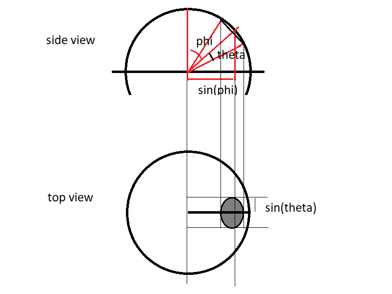
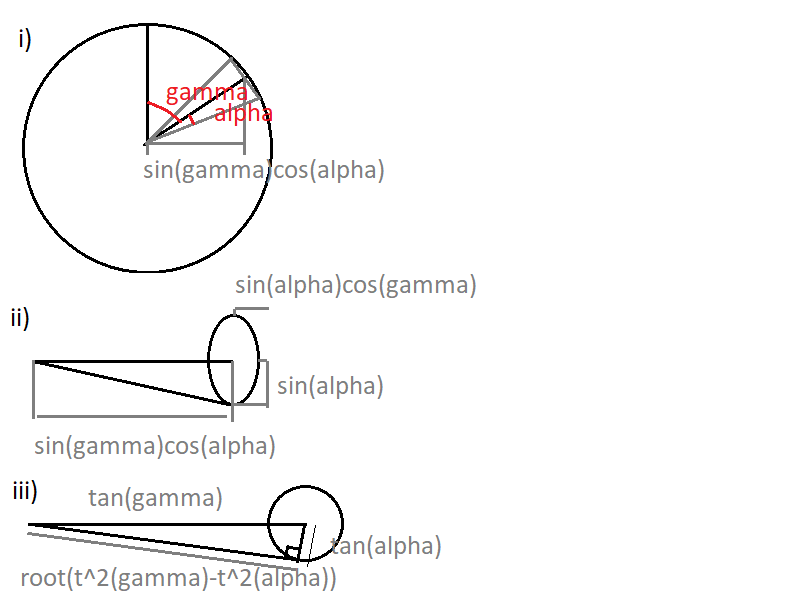

At time of writing, portal lighting is buggy, especially when portal is darker than world, which is treated as a negative light.

Some comments in shaders eg "//this is just bodged/guessed to achieve correct behaviour at/across portal. TODO check/correct!"

# Diffuse light

Want portal light to act like a regular point light when distant, but at surface/crossing portal, should act like a hemispherical skylight.

Basically lighting is from a sphere with emmissive surface. 4d doesn't matter - just the view from the surface. 

Have thought about this, will describe roughly here, confident correct enough... 

Portal light and sky light. Separate into isotropic light from current world - later might improve this to treat this as eg hemispherical skylight near to ground etc. Considering a simplified view from the surface where just the world/fog colour can be seen, and flat coloured portals. Each portal's light contribution is of colour that is the difference between its colour (ie the colour of the world beyond the portal), and the current world (that the receiving surface is in).  No consideration of casting a light through another portal. (ie the surface seeing a portal within a portal). Also ignore impact of one portal blocking another's light, though this could result in net negative light being cast for portals into two dark worlds next door to eachother.

Consider a light of angular radius alpha, centred at angle theta from straight above the surface. If we consider the sphere/hemisphere at distance 1 from the surface point, and project the view onto this surface, AFAICT the diffuse contribution from here is like the area of the disc of light on this hemisphere projected along surface normal onto the surface plane. ie radius $\sin\theta$, so fraction of circle viewed in surface normal direction is $\sin^2\theta$. ( total circle area = $\pi$, area of disc viewed from above = $\pi\sin^2\theta$ ).

Similarly, for portal with centre at angle phi from directly above the surface, 

However, when the disc of light viewed from the surface is not entirely above the horizon, this calculation is incorect, because it counts a negative contribution of light from below the horizon. However, this contibution should be ignored.

Full calculation appears to be quite complicated. Consider 2D case instead, of an arc or line of light. The side view of Diagram 1 is relevant. Suspect that results for 2D, 3D are same for $\phi < \pi/2 - \theta$ (disc completely above horizon), $\phi > \pi/2 + \theta$ (disc completely below horizon), and for case on surface of lit object where $\theta = \pi/2$. Results for partly above, below horizon - expect incorrect, but should be continuous and plausible.

### Contribution of lighting (fraction of total hemispere projected area) 

Diagram 1 represents finding the lighting contribution from the local sky, viewed from a surface point at the centre of the hemisphere (0,0,0). The fact that the game is on a 3-sphere surface is irrelevant here.

In Diagram 1, the lighting contribution to the surface from the round light in the sky in the sky is proportional to the shaded elliptical area in the top view. The remaining area of the circle (area of circle minus shaded area) contributes the sky colour. This is equivalent to the whole circle times the sky colour, plus the shaded area time the difference between the round light colour and the sky colour.

$\sin(\min (\pi/2, \phi+\theta)) - \sin( \min (\pi/2, \phi-\theta))$  &nbsp;&nbsp;&nbsp;&nbsp;&nbsp;(1)

width of this area when viewed from above is $2*\sin\theta$

to get total area divided by whole circle area, for circle of radius 1, multiply these terms, divide by 4.

$( \sin(\min (\pi/2, \phi+\theta) - \sin( \min (\pi/2, \phi-\theta)) ) ) * \sin\theta /2$

seems like could use compound angle to simplify this but min, max complicates.

### check reproduces simple case for hemisphere lighting

check this reduces to simple dot product lighting when theta = $\pi/2$

$\sin(\min (\pi/2, \phi+\pi/2)) - \sin( \min (\pi/2, \phi-\pi/2))$

since $0 \le \phi \le \pi$, &nbsp;&nbsp; (1) becomes

$\sin(\phi+\pi/2) - \sin(\phi-\pi/2)$

use compound angle $\sin(A + B) = \sin(A)\cos(B) + \cos(A)\sin(B)$

=> $( \sin\phi\cos(\pi/2) - \cos\phi\sin(\pi/2) )  - ( \sin\phi\cos(-\pi/2) - \cos\phi\sin(-\pi/2) )$

=> $ -\cos\phi\sin(\pi/2) + \cos\phi\sin(-\pi/2) = 2\cos\phi$

combine with width term $2\sin(\pi/2) = 2$. divide by 4, result is $\cos\phi$

in summary, for diffuse use 

$( \sin(\min (\pi/2, \phi+\theta) - \sin( \min (\pi/2, \phi-\theta)) ) ) * sin(theta) /2$ &nbsp;&nbsp;&nbsp;&nbsp;&nbsp;(2)

ie total lighting = background colour * difference colour* equation 2

# How to code this  - what are current shader inputs, how is colour scaled etc.

code from current shader:

float posCosDiff = dot(normalize(transformedCoord),uReflectorPos) - uReflectorCos;

vPortalLightPosTangentSpace, posCosDiff
 
Can calculate the size of portal (reflector) circle when seen from surface from surface space (using vPortalLightPosTangentSpace) or transformed space (in frame of camera). Expect get same result. Perhaps one is more efficient given other calcs required. Seems that transformed surface point and portal position (in frame of camera), is normalise(transformedCoord) and uReflectorPos. The size of portal can get by projecting the portal onto the 3d plane that touches the 3-sphere at normalise(transformedCoord). 

Note that Diagram 2 is coincidentally the same construction as Diagram 1, but the situations should not be confused!

In Diagram 2, the surface of the sphere (2-sphere) is represents the 3-sphere surface. Instead of $x,y,z,w$, axes, it uses $r,y,z$, where $r^2=x^2+y^2$. The viewpoint is at (0,0,1). I believe this representation doesn't lose anything and the results found using it are correct. The disc on this surface represents the spherical portal light. 

i) is view from the side (w vertical, z horizontal). ii) is view from above (z horizontal, r vertical). iii) the horizontal scale is divided by $\cos\gamma$ to make the ellipse a circle, and quantities divided by $\cos\alpha$ to simplify. From here, project the angled line to the vertical line through the circle using similar triangles to get a height of $\frac{\tan\alpha\tan\gamma}{\sqrt{\tan^2\gamma - \tan^2\alpha}}$. Scale horizontally by $\cos\gamma$ to revert to original proportions. Now have a triangle with

$\tan\theta = opp/adj = \frac{\frac{\tan\alpha\tan\gamma}{\sqrt{\tan^2\gamma - \tan^2\alpha}}}{\tan\gamma\cos\gamma} = \frac{\tan\alpha}{\cos\gamma\sqrt{\tan^2\gamma - \tan^2\alpha}} = \frac{\tan\alpha}{\sqrt{\sin^2\gamma - \tan^2\alpha\cos^2\gamma}}$

Summary: for a portal/reflector of angular size in world $\alpha$, at angular distance from the surface/viewer gamma, apparent angular size $\theta$ related by equation 3:

$\tan(\theta) = \tan(\alpha)/\sqrt{ \sin^2\gamma -\tan^2\alpha\cos^2\gamma }$ &nbsp;&nbsp;&nbsp;&nbsp;&nbsp;(3)

Here $\alpha = \arccos(uReflectorCos)$, so $\tan\alpha = \sqrt{(1-uReflectorCos^2)/uReflectorCos} = \sqrt{uReflectorCos^-2 -1}$

$\gamma$ is angle between normalize(transformedCoord) and uReflectorPos

Should also take into account visibility factor - is blocked from view by fog or landscape. perhaps a per vertex calc (as is done currently for fog), or per object calculation for small objects. 

For the angle of elevation above the surface, $\phi$, this is hopefully $\arcsin(vPortalLightPosTangentSpace.w)$

This should give enough info to calculate diffuse lighting.

# Specular

Want specular lighting too. "PBR" usually takes into account that specular becomes stronger when view at glancing angle, but don't bother yet. TODO update existing specular code with portal size as viewed from surface, falloff, consistent with used for specular.

