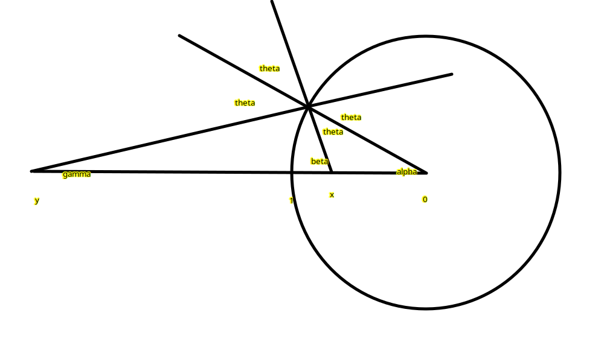
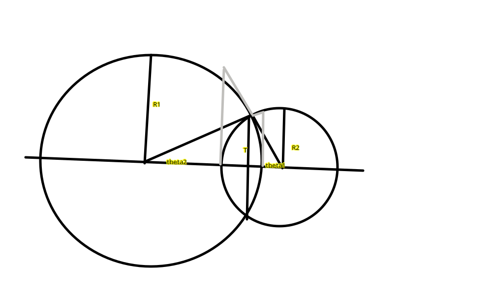

# portal rendering

To describe portal rendering, start with simple case of spherical reflector in flat space and build up to general case of spherical portal between differently sizes 3-sphere worlds.

# general spherical reflector rendering in flat space

Take camera position outside portal, "reflect" point in portal. Render world (currently using cube map) from this reflected point. Project view from the reflected point onto the surface of the reflector, seen by the original point.

The reflected point is chosen such that the reflection looks right when viewing the reflector head-on. The result isn't quite right for larger angles, but has reflected items on the surface of the reflector in the right place. 

Can calculate the reflected point considering small angles.

Point x,y express as distance from origin.

For small angle theta, can derive

$$
2xy = x+y
$$

Which is hyperbola

$$
y = \frac{x}{2x-1}
$$

# adaptation to 3-sphere space

Can consider projective space, projected from spherical space onto flat space perpendicular to the reflector/portal centre position. Since great circles in this space project to straight lines in this projected space, flat space small angle result remains valid. 

# adaptation to portal

portal works like a mirror/teleporter. explanation left as an exercise!

# variable size worlds (implemented 2026-05)

for portal sphere with radius r in flat space, currently projecting onto world with radius 1.

when have different size worlds, should ensure that both sides of portal have same surface area - same size before projection won't work for different size worlds.

describe portal size by angular radius. equivalent angular radius is like atan(r)

worlds 1,2 radii $R_1, R_2$.

for portal occupying half of world with radius R, with maximum size surface area in that world, has angular radius $\theta = \pi/2$, and "true" radius R. For general angular radius a, "true" portal radius is $R\sin{\theta}$

Store "true" radius for portal, can easily ensure that it's less than or equal to the world size radius of each world a portal side is in.

True radius $T \le R_1, R_2$

Angular radius in worlds 1,2 = $\theta_1$, $\theta_2$

$R_1 \sin{\theta_1} = R_2 \sin{\theta_2} =  T $

In the image, grey parts show "projected" radii which is relevant to some variables in code. The intermediate plane is marked with shared radius T.